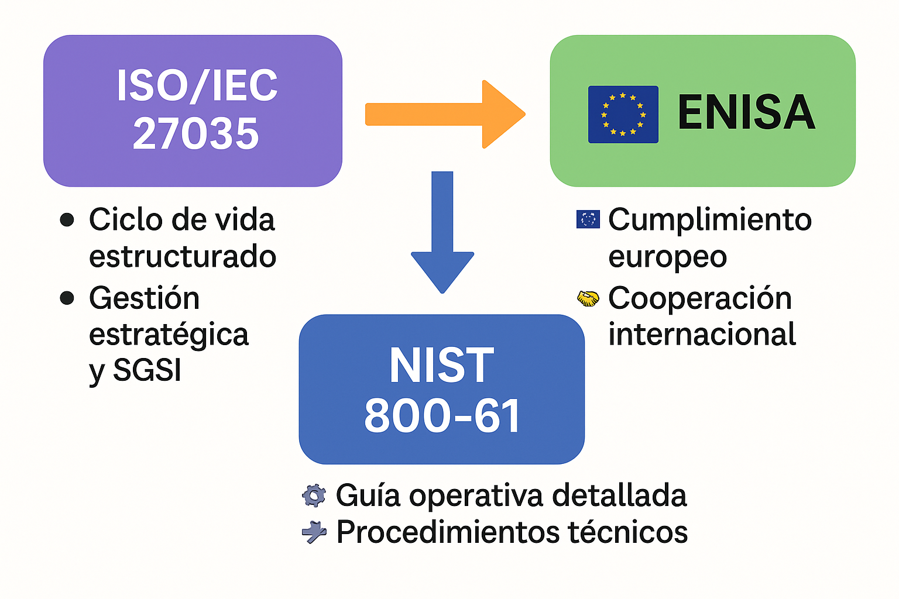

# 🎯 Gestión de Incidentes de Seguridad – Guía Completa

> 🌍 Documento comparativo y práctico sobre las **metodologías internacionales más utilizadas** en la gestión de incidentes:  
> **ISO/IEC 27035**, **NIST 800-61 Rev.2** y las guías de **ENISA**.  
> Diseñado para SOCs, CISO, Blue Teams y equipos de respuesta a incidentes.

---

## 🛡️ ISO/IEC 27035 – Modelo de Respuesta

📌 **Enfoque principal:** Proporcionar un **ciclo de vida estructurado** para la gestión de incidentes de seguridad de la información.  
Forma parte de la familia ISO/IEC 27000.

---

### 🔁 Ciclo de Vida ISO/IEC 27035

| Fase | Descripción | Actividades clave |
|------|-------------|-------------------|
| **1. Preparación** | Establecer roles, procedimientos y herramientas. | Políticas, CSIRT, formación, SIEM, IDS. |
| **2. Identificación** | Detectar y notificar eventos. | Monitorización, clasificación, notificación. |
| **3. Evaluación y Decisión** | Analizar impacto y decidir acciones. | Priorización, categorización, escalado. |
| **4. Respuesta** | Contener, erradicar y recuperar. | Aislamiento, eliminación de amenazas, restauración. |
| **5. Lecciones Aprendidas** | Mejorar continuamente. | Documentación, reunión post-mortem, actualización de procesos. |

---

> 💡 **TIP ISO27035:**  
> Documentar **líneas de tiempo** y **decisiones tomadas** durante el incidente es clave para auditorías y lecciones aprendidas.

---

## 🦅 NIST 800-61 Rev.2 – Computer Security Incident Handling Guide

📌 **Enfoque principal:** Proporcionar un **marco operativo detallado** para equipos de respuesta a incidentes, especialmente en EE.UU., pero usado globalmente.

---

### 🔁 Ciclo de Vida según NIST

| Fase | Subfases | Descripción |
|------|----------|-------------|
| **1. Preparación** | Política, formación, herramientas. | Establecer infraestructura de respuesta. |
| **2. Detección y Análisis** | Identificación, validación, clasificación. | Uso de IDS, SIEM, correlación de eventos. |
| **3. Contención, Erradicación y Recuperación** | Corto, medio y largo plazo. | Mitigar, eliminar, restaurar sistemas. |
| **4. Actividad Post-incidente** | Revisión, documentación, mejora. | Lecciones aprendidas, métricas, informes. |

---

### 📊 Diferencias con ISO 27035

| Aspecto | ISO/IEC 27035 | NIST 800-61 Rev.2 |
|---------|---------------|-------------------|
| **Ámbito** | Internacional, SGSI. | Operativo, SOCs y equipos CSIRT. |
| **Detalle técnico** | General y normativo. | Muy detallado (playbooks, ejemplos). |
| **Enfoque** | Mejora continua en SGSI. | Guía práctica para respuesta inmediata. |

---

> 🔐 **TIP NIST:**  
> Utiliza **métricas** para evaluar la eficacia de tu respuesta:  
> - Tiempo medio de detección (MTTD).  
> - Tiempo medio de respuesta (MTTR).  
> - Tasa de falsos positivos en alertas.

---

## 🇪🇺 ENISA – Agencia Europea de Ciberseguridad

📌 **Enfoque principal:** Publicar guías y buenas prácticas para la **gestión de incidentes a nivel europeo**, alineadas con la Directiva NIS2 y GDPR.  

---

### 🔑 Metodología de ENISA

| Fase | Recomendaciones ENISA |
|------|------------------------|
| **Preparación** | Definir roles, cooperación internacional, ejercicios de simulación, compartir inteligencia (CTI). |
| **Detección** | Uso de honeypots, SIEM, monitorización 24/7, intercambio de alertas. |
| **Análisis** | Colaboración entre CERTs europeos, categorización uniforme de incidentes. |
| **Respuesta** | Contención rápida, coordinación con proveedores y autoridades. |
| **Recuperación y Reporte** | Informar a reguladores (GDPR, NIS2), compartir lecciones aprendidas con la comunidad. |

---

### 🌐 Relación con la normativa europea

- **NIS2**: obliga a reportar incidentes significativos en 24 horas.  
- **GDPR**: exige notificación de brechas de datos personales en 72 horas.  
- **ENISA** proporciona plantillas y guías para cumplir estos plazos.

---

> 📣 **TIP ENISA:**  
> Participa en redes de **Threat Intelligence** y colaboración CERT/CSIRT para mejorar la capacidad de detección y reacción.

---

## ⚔️ Comparativa Final

| Norma / Guía | Orientación | Nivel de Detalle | Uso típico |
|--------------|-------------|------------------|------------|
| **ISO/IEC 27035** | Gestión estratégica y SGSI. | Medio. | Organizaciones que siguen ISO/IEC 27001. |
| **NIST 800-61 Rev.2** | Guía operativa técnica. | Alto. | SOCs, CERTs, CSIRTs. |
| **ENISA** | Cumplimiento normativo UE. | Medio-alto. | Empresas europeas bajo GDPR/NIS2. |

---

## 🚀 Conclusión

Cada marco aporta un **valor complementario**:

- **ISO 27035**: marco estratégico global.  
- **NIST 800-61**: manual operativo detallado.  
- **ENISA**: enfoque europeo y cumplimiento regulatorio.  

> 🔥 **Estrategia ganadora:**  
> Adoptar ISO 27035 como marco **base**,  
> apoyarse en NIST 800-61 para **procedimientos técnicos**,  
> y seguir ENISA para **cumplimiento europeo y cooperación internacional**.

-------------------------------------------------------------------

🛡️ ISO/IEC 27035 – Modelo de respuesta ante incidentes
La norma ISO/IEC 27035 se divide en varias partes, pero la más utilizada es la Parte 1, que establece los principios y procesos para la gestión de incidentes de seguridad de la información.

El modelo de respuesta se encuentra en el ciclo de vida de gestión de incidentes, que puede dividirse en las siguientes fases:

🔁 1. Preparación
Objetivo: Establecer las bases para poder actuar de forma eficaz ante incidentes.

Actividades clave:

Definir roles y responsabilidades (equipo CSIRT/IRT).

Crear y documentar políticas y procedimientos de respuesta.

Formar al personal y realizar simulacros.

Establecer canales de comunicación internos y externos.

Implementar herramientas de detección (SIEM, IDS/IPS, EDR, etc.).

Clasificar y priorizar activos.

🧠 La preparación reduce el tiempo de respuesta y mejora la toma de decisiones durante un incidente.

🔍 2. Identificación / Detección y Notificación
Objetivo: Detectar de forma temprana eventos anómalos o incidentes reales.

Actividades clave:

Monitorización continua de sistemas y redes.

Uso de alertas automatizadas y dashboards.

Clasificación de eventos: ¿es un incidente real?

Registro de la información: fecha/hora, origen, afectación, etc.

Notificación interna a las partes responsables.

🛠️ Herramientas como SIEM (Splunk, Wazuh, ELK), IDS (Snort, Suricata), y EDR pueden ser clave en esta fase.

🚨 3. Evaluación y Decisión
Objetivo: Analizar la situación para decidir la mejor estrategia de respuesta.

Actividades clave:

Evaluar el impacto y la urgencia.

Categorizar el incidente (por tipo: malware, acceso no autorizado, fuga de datos…).

Clasificar el nivel de severidad.

Decidir si se escala o se puede manejar internamente.

Activar los procedimientos y recursos apropiados.

🧮 Aquí se aplican metodologías como el análisis de impacto y priorización basada en riesgo.

🛠️ 4. Respuesta
Objetivo: Contener, erradicar y recuperar los sistemas afectados.

Subfases de respuesta:

a) Contención:
Aislar equipos, cortar comunicaciones, bloquear accesos.

Evitar propagación del incidente.

b) Erradicación:
Eliminar malware, cerrar brechas, cambiar credenciales comprometidas.

Asegurarse de que no queden trazas del atacante.

c) Recuperación:
Restaurar servicios y sistemas a su estado funcional.

Validar que todo está limpio (pruebas de integridad).

Monitorizar por posibles reinfecciones.

⛑️ La rapidez y precisión en esta fase son clave para minimizar daños.

📚 5. Lecciones Aprendidas / Mejora Continua
Objetivo: Aprender del incidente para evitar que se repita.

Actividades clave:

Documentar todo lo ocurrido: línea de tiempo, decisiones tomadas, impacto, etc.

Reunión post-mortem con todos los actores implicados.

Evaluación de la eficacia de la respuesta.

Actualizar procedimientos, controles y planes.

Capacitar al personal en función de lo aprendido.

📈 Esta fase alimenta la mejora continua del SGSI (Sistema de Gestión de Seguridad de la Información).

📊 Resumen visual del ciclo ISO 27035:
      +--------------------+
      |    Preparación     |
      +--------------------+
               ↓
+------------------------------+
| Detección / Notificación     |
+------------------------------+
               ↓
+------------------------------+
| Evaluación y Decisión        |
+------------------------------+
               ↓
+------------------------------+
| Contención / Erradicación    |
| / Recuperación               |
+------------------------------+
               ↓
+------------------------------+
|   Lecciones Aprendidas       |
+------------------------------+
               ↓
        (Vuelta al inicio)
🧩 Integración con otras normas
ISO/IEC 27035 se integra perfectamente con otras normas y metodologías:

🔐 ISO/IEC 27001: dentro del marco de seguridad general del SGSI.

🚒 ISO 22301: continuidad del negocio.

🧪 NIST 800-61: guía técnica complementaria de respuesta a incidentes.

📜 MITRE ATT&CK: para categorizar tácticas y técnicas usadas por atacantes.

✅ Beneficios de aplicar el modelo ISO/IEC 27035
Respuesta más rápida y eficaz ante incidentes.

Reducción del impacto técnico, económico y reputacional.

Mayor cumplimiento normativo y preparación ante auditorías.

Cultura organizacional proactiva frente a amenazas.

Mejora continua basada en análisis real.

****
sualba.dev © 2025 - Todos los derechos reservados