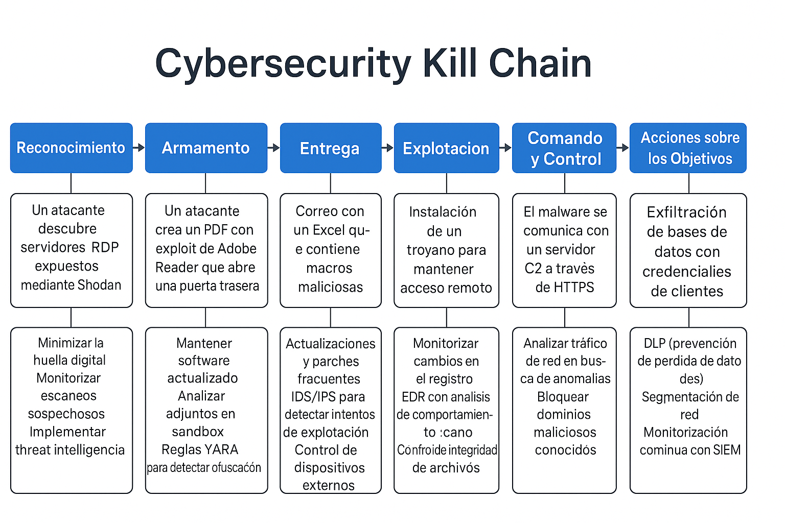
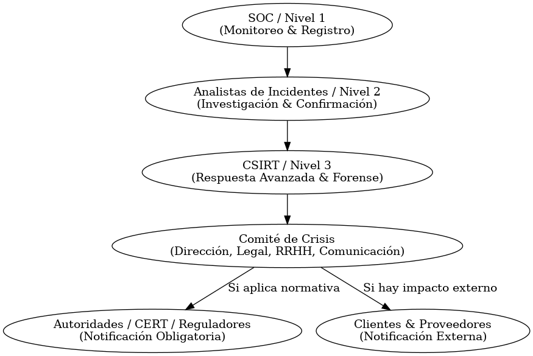

# 📌 Comunicación y Escalado en Incidentes de Seguridad

## 1. Fases de la Gestión de Incidentes
Basado en estándares como **NIST 800-61r2** e **ISO 27035**:

1. **Detección y Registro**
   - **Detección**: Alertas del SIEM, IDS/IPS, EDR, reportes de usuarios o terceros.
   - **Registro**: Todo incidente debe documentarse en una **plataforma de ticketing** (ej. ServiceNow, TheHive, JIRA).
   - **Clasificación inicial**: Determinar categoría (malware, phishing, DDoS, fuga de datos, etc.) y severidad.

2. **Análisis y Evaluación**
   - **Análisis técnico**:
     - Confirmar el incidente (false positive vs true positive).
     - Recopilar evidencias (logs, imágenes de disco, capturas de red).
     - Usar herramientas (Splunk, Wireshark, Volatility, YARA, VirusTotal).
   - **Evaluación de impacto**: Determinar sistemas afectados, nivel de confidencialidad/integridad/disponibilidad comprometido y riesgo de propagación.

3. **Respuesta y Contención**
   - Acciones inmediatas para **limitar daños** (aislar host, bloquear IP, revocar credenciales).
   - Decisión sobre si **informar** o mantener la investigación discreta.

4. **Erradicación y Recuperación**
   - Limpieza de sistemas.
   - Parcheo y cierre de brechas.
   - Restauración de servicios.

5. **Lecciones Aprendidas y Cierre**
   - Informe final con timeline, impacto, medidas aplicadas y recomendaciones.
   - Reunión de retroalimentación con el CSIRT.

---

## 2. Roles y Responsabilidades

| Rol | Funciones principales |
|-----|------------------------|
| **Incident Handler** | Lidera la gestión del incidente, coordina análisis y respuesta. |
| **Técnicos de Análisis (Blue Team / Forense)** | Recolectan evidencias, ejecutan análisis de logs, malware, tráfico de red. |
| **Gestión de Incidentes** | Valora impacto, clasifica nivel de severidad, decide escalado. |
| **Gestión de Crisis** | Activa protocolos cuando el incidente es **crítico** (afecta negocio, reputación o legalidad). |
| **Comité de Crisis** | Equipo multidisciplinar (IT, RRHH, Legal, Comunicación, Dirección). Define decisiones estratégicas. |
| **CSIRT** (Computer Security Incident Response Team) | Equipo especializado en **detección, respuesta y coordinación** de incidentes complejos. Puede ser interno, nacional o sectorial. |
| **Responsable de Seguridad (CISO o equivalente)** | Supervisión, comunicación con la dirección y notificación a organismos externos si aplica. |

---

## 3. Escalado y Coordinación

### Escalado Interno
1. **Nivel 1 – SOC / Help Desk**
   - Monitoreo inicial.
   - Registro y triage de alertas.
2. **Nivel 2 – Analistas de Incidentes**
   - Investigación detallada.
   - Confirmación de incidente real.
3. **Nivel 3 – Especialistas Forenses / CSIRT**
   - Respuesta avanzada, malware reversing, análisis de intrusión compleja.
4. **Escalado a Comité de Crisis**
   - Cuando el incidente amenaza **operaciones críticas, reputación o cumplimiento legal**.

### Coordinación entre Equipos
- Uso de **playbooks** (SOAR) para respuesta estructurada.
- Canales de comunicación segura (ej. **Mattermost en red interna, Signal, MISP para compartir IOCs**).
- Reuniones de sincronización con timeline claro.

---

## 4. Notificación a Terceras Partes
Según el impacto y marco legal:

- **Proveedores o partners**: Si el incidente puede afectar su seguridad.
- **Clientes**: Cuando hay fuga de datos personales o interrupción de servicio relevante.
- **Autoridades regulatorias**:
  - **GDPR (UE)** → Notificación en ≤ 72h si implica datos personales.
  - **INCIBE-CERT (España)** o **ENISA (UE)** → Para incidentes relevantes.
  - **CERT nacional** o sectorial (ej. financiero, sanitario).
- **Fuerzas de seguridad (LEA)**: Si implica ciberdelito.

---

## 5. Comunicación Durante el Incidente
- **Principio de mínima divulgación**: compartir solo con quienes necesitan saber.
- **Canales alternativos**: No usar sistemas posiblemente comprometidos.
- **Mensajes claros y consistentes**:
  - Técnicos → detallados (logs, IOCs, timeline).
  - Dirección → impacto, riesgos, plan de acción.
  - Público (si aplica) → comunicado oficial revisado por el comité de crisis.

---

## 6. Diagrama de Flujo de Escalado y Coordinación

****
sualba.dev © 2025 - Todos los derechos reservados