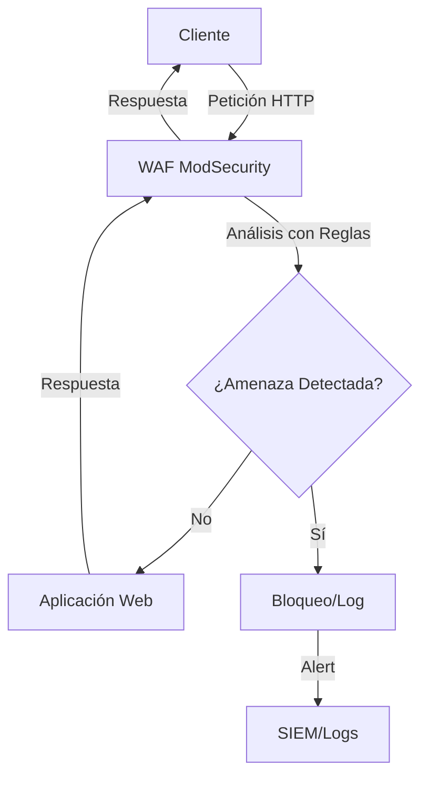

# 🛡️ ModSecurity: Guía Completa de WAF para Profesionales de Ciberseguridad

## 📋 Tabla de Contenidos
- [Introducción](#introducción)
- [¿Qué es ModSecurity?](#qué-es-modsecurity)
- [Arquitectura y Funcionamiento](#arquitectura-y-funcionamiento)
- [Sintaxis de Reglas](#sintaxis-de-reglas)
- [Variables, Operadores y Acciones](#variables-operadores-y-acciones)
- [Ejemplos Prácticos de Reglas](#ejemplos-prácticos-de-reglas)
- [OWASP Core Rule Set (CRS)](#owasp-core-rule-set-crs)
- [Configuración Avanzada](#configuración-avanzada)
- [Integración con SIEM](#integración-con-siem)
- [Evasión de WAF y Contramedidas](#evasión-de-waf-y-contramedidas)
- [Tuning y Optimización](#tuning-y-optimización)
- [Laboratorio de Pruebas](#laboratorio-de-pruebas)
- [Troubleshooting](#troubleshooting)
- [Buenas Prácticas](#buenas-prácticas)
- [Recursos y Referencias](#recursos-y-referencias)

---

## 📌 Introducción

Las **aplicaciones web** representan más del 70% de los vectores de ataque en internet según OWASP. Un **Web Application Firewall (WAF)** es la primera línea de defensa contra amenazas como:

- **SQL Injection**
- **Cross-Site Scripting (XSS)**
- **Path Traversal / LFI / RFI**
- **Command Injection**
- **CSRF (Cross-Site Request Forgery)**
- **Ataques de fuerza bruta**
- **Escaneo de vulnerabilidades**

**ModSecurity** es el WAF open source más utilizado del mundo, proporcionando protección robusta y flexible para aplicaciones web críticas.

### ¿Por qué ModSecurity?

✅ **Open Source** y respaldado por OWASP  
✅ **Compatible** con Apache, Nginx e IIS  
✅ **Flexible** - reglas personalizadas y CRS  
✅ **Escalable** - desde entornos pequeños a enterprise  
✅ **Integrable** con SIEM y herramientas de monitoreo  
✅ **Compliance** - ayuda con PCI DSS, ISO 27001  

---

## 📊 ¿Qué es ModSecurity?

**ModSecurity** es un **Web Application Firewall (WAF)** de código abierto desarrollado originalmente por SpiderLabs y actualmente mantenido por OWASP. Opera como un módulo que se integra directamente con el servidor web para inspeccionar el tráfico HTTP/HTTPS en tiempo real.

### Modos de Operación

| Modo | Descripción | Uso Recomendado |
|------|-------------|----------------|
| **DetectionOnly (IDS)** | Solo detecta y registra | Fase inicial, tuning |
| **Blocking (IPS)** | Detecta y bloquea | Producción |

### Compatibilidad

- **Apache HTTP Server** (mod_security2)
- **Nginx** (con ModSecurity v3)
- **Microsoft IIS** (con ModSecurity v3)
- **Envoy Proxy** (experimental)

---

## 🏗️ Arquitectura y Funcionamiento



### Fases de Procesamiento

1. **Phase 1**: Análisis de cabeceras de petición
2. **Phase 2**: Análisis del cuerpo de la petición
3. **Phase 3**: Análisis de cabeceras de respuesta
4. **Phase 4**: Análisis del cuerpo de la respuesta
5. **Phase 5**: Logging y auditoría

---

## ⚙️ Sintaxis de Reglas

### Estructura Básica

```apache
SecRule VARIABLES OPERATOR ACTIONS
```

### Componentes

- **VARIABLES**: Qué parte del tráfico inspeccionar
- **OPERATOR**: Qué patrón o condición buscar
- **ACTIONS**: Qué hacer cuando se cumple la condición

### Ejemplo Simple

```apache
SecRule ARGS "@rx select.+from" \
    "id:1002,phase:2,deny,status:403,msg:'SQL Injection detectada'"
```

---

## 🔧 Variables, Operadores y Acciones

### Variables Principales

| Variable | Descripción | Ejemplo |
|----------|-------------|---------|
| `ARGS` | Todos los parámetros | `SecRule ARGS "@rx malicious"` |
| `ARGS_GET` | Solo parámetros GET | `SecRule ARGS_GET "@contains ../"`  |
| `ARGS_POST` | Solo parámetros POST | `SecRule ARGS_POST "@rx <script>"` |
| `REQUEST_URI` | URI de la petición | `SecRule REQUEST_URI "@beginsWith /admin"` |
| `REQUEST_HEADERS` | Cabeceras HTTP | `SecRule REQUEST_HEADERS:User-Agent "@contains bot"` |
| `REQUEST_BODY` | Cuerpo de la petición | `SecRule REQUEST_BODY "@contains malware"` |
| `REQUEST_COOKIES` | Cookies | `SecRule REQUEST_COOKIES "@rx javascript:"` |
| `REMOTE_ADDR` | IP del cliente | `SecRule REMOTE_ADDR "@ipMatch 192.168.1.0/24"` |
| `FILES` | Archivos subidos | `SecRule FILES "@rx \.php$"` |

### Operadores Comunes

| Operador | Función | Ejemplo |
|----------|---------|---------|
| `@rx` | Expresión regular | `@rx "union.*select"` |
| `@contains` | Contiene cadena | `@contains "script"` |
| `@beginsWith` | Empieza con | `@beginsWith "/etc/"` |
| `@endsWith` | Termina con | `@endsWith ".exe"` |
| `@ipMatch` | Coincidencia IP/CIDR | `@ipMatch "10.0.0.0/8"` |
| `@pm` | Lista de palabras | `@pm "passwd admin root"` |
| `@eq` | Igual a | `@eq "1"` |
| `@gt` | Mayor que | `@gt "100"` |
| `@lt` | Menor que | `@lt "10"` |

### Acciones Principales

| Acción | Función | Ejemplo |
|--------|---------|---------|
| `deny` | Bloquear petición | `deny,status:403` |
| `drop` | Cerrar conexión | `drop` |
| `redirect` | Redireccionar | `redirect:http://example.com/blocked` |
| `log` | Registrar en log | `log,msg:'Ataque detectado'` |
| `pass` | Permitir y continuar | `pass,log,msg:'Sospechoso pero permitido'` |
| `block` | Usar acción por defecto | `block` |

### Transformaciones

| Transformación | Función |
|----------------|---------|
| `t:lowercase` | Convertir a minúsculas |
| `t:uppercase` | Convertir a mayúsculas |
| `t:urlDecodeUni` | Decodificar URL (UTF-8) |
| `t:htmlEntityDecode` | Decodificar entidades HTML |
| `t:removeNulls` | Eliminar bytes nulos |
| `t:removeWhitespace` | Eliminar espacios |
| `t:compressWhiteSpace` | Comprimir espacios múltiples |

---

## 🎯 Ejemplos Prácticos de Reglas

### Detección de SQL Injection

```apache
# SQL Injection básica
SecRule ARGS "@rx (?i)(union.*select|select.*from|insert.*into)" \
    "id:1001,phase:2,block,msg:'SQL Injection detectada',severity:CRITICAL"

# SQL Injection con evasión
SecRule ARGS "@rx (?i)(un\W*ion|sel\W*ect|in\W*sert)" \
    "id:1002,phase:2,block,msg:'SQL Injection con evasión',severity:CRITICAL"
```

### Detección de XSS

```apache
# XSS básico
SecRule ARGS "@rx (?i)<script[^>]*>" \
    "id:1010,phase:2,block,msg:'XSS detectado',severity:HIGH"

# XSS avanzado con event handlers
SecRule ARGS "@rx (?i)on(load|click|mouse|error|focus)=" \
    "id:1011,phase:2,block,msg:'XSS con event handler',severity:HIGH"
```

### Detección de Path Traversal

```apache
# Path Traversal clásico
SecRule REQUEST_URI|ARGS "@rx \.\.\/" \
    "id:1020,phase:2,block,msg:'Path Traversal detectado',severity:CRITICAL"

# Path Traversal con encoding
SecRule REQUEST_URI|ARGS "@rx (%2e%2e%2f|%2e%2e%5c|%252e%252e%252f)" \
    "id:1021,phase:2,block,msg:'Path Traversal codificado',severity:CRITICAL"
```

### Detección de Command Injection

```apache
# Command Injection
SecRule ARGS "@rx (?i)(;|\||&|&&|\$\(|\`)" \
    "id:1030,phase:2,block,msg:'Command Injection detectado',severity:CRITICAL"
```

### Detección de File Upload Malicioso

```apache
# Extensiones peligrosas
SecRule FILES "@rx \.(php|asp|aspx|jsp|pl|py|sh|bat)$" \
    "id:1040,phase:2,block,msg:'Upload de archivo peligroso',severity:HIGH"
```

### Protección contra Scanners

```apache
# Nikto Scanner
SecRule REQUEST_HEADERS:User-Agent "@contains nikto" \
    "id:1050,phase:1,deny,status:403,msg:'Nikto scanner detectado'"

# Sqlmap
SecRule REQUEST_HEADERS:User-Agent "@contains sqlmap" \
    "id:1051,phase:1,deny,status:403,msg:'SQLMap detectado'"

# Dirb/Dirbuster
SecRule REQUEST_HEADERS:User-Agent "@rx (dirb|dirbuster)" \
    "id:1052,phase:1,deny,status:403,msg:'Directory scanner detectado'"
```

### Rate Limiting

```apache
# Limitar peticiones por IP
SecRule IP:bf_block "@eq 1" \
    "id:1060,phase:1,deny,status:429,msg:'Rate limit excedido'"

SecRule REMOTE_ADDR "@unconditionalMatch" \
    "id:1061,phase:1,pass,setvar:ip.requests=+1,expirevar:ip.requests=60"

SecRule IP:requests "@gt 100" \
    "id:1062,phase:1,pass,setvar:ip.bf_block=1,expirevar:ip.bf_block=300"
```

---

## 📦 OWASP Core Rule Set (CRS)

El **OWASP Core Rule Set** es un conjunto de reglas genéricas que protegen contra los ataques más comunes del OWASP Top 10.

### Instalación

```bash
# Descargar CRS
git clone https://github.com/coreruleset/coreruleset /etc/modsecurity-crs

# Configurar
cd /etc/modsecurity-crs
cp crs-setup.conf.example crs-setup.conf
```

### Configuración en Apache

```apache
# En httpd.conf o site.conf
Include /etc/modsecurity-crs/crs-setup.conf
Include /etc/modsecurity-crs/rules/*.conf
```

### Configuración en Nginx

```nginx
# En nginx.conf
modsecurity_rules_file /etc/modsecurity-crs/crs-setup.conf;
modsecurity_rules '
    Include /etc/modsecurity-crs/rules/*.conf
';
```

### Estructura del CRS

- **REQUEST-900-EXCLUSION-RULES-BEFORE-CRS**: Exclusiones antes del CRS
- **REQUEST-901-INITIALIZATION**: Inicialización
- **REQUEST-905-COMMON-EXCEPTIONS**: Excepciones comunes
- **REQUEST-910-IP-REPUTATION**: Reputación de IPs
- **REQUEST-911-METHOD-ENFORCEMENT**: Métodos HTTP permitidos
- **REQUEST-920-PROTOCOL-ENFORCEMENT**: Cumplimiento de protocolo
- **REQUEST-921-PROTOCOL-ATTACK**: Ataques de protocolo
- **REQUEST-930-APPLICATION-ATTACK-LFI**: Local File Inclusion
- **REQUEST-931-APPLICATION-ATTACK-RFI**: Remote File Inclusion
- **REQUEST-932-APPLICATION-ATTACK-RCE**: Remote Code Execution
- **REQUEST-933-APPLICATION-ATTACK-PHP**: Ataques específicos PHP
- **REQUEST-941-APPLICATION-ATTACK-XSS**: Cross-Site Scripting
- **REQUEST-942-APPLICATION-ATTACK-SQLI**: SQL Injection
- **REQUEST-943-APPLICATION-ATTACK-SESSION-FIXATION**: Session Fixation
- **REQUEST-949-BLOCKING-EVALUATION**: Evaluación de bloqueo

---

## 🔧 Configuración Avanzada

### Configuración Principal ModSecurity

```apache
# /etc/modsecurity/modsecurity.conf

# Habilitar ModSecurity
SecRuleEngine On

# Configurar auditoría
SecAuditEngine RelevantOnly
SecAuditLogRelevantStatus "^(?:5|4(?!04))"
SecAuditLogParts ABDEFHIJZ
SecAuditLogFormat JSON
SecAuditLog /var/log/modsec_audit.log

# Configurar debugging (solo desarrollo)
SecDebugLog /var/log/modsec_debug.log
SecDebugLogLevel 0

# Límites de carga
SecRequestBodyAccess On
SecRequestBodyLimit 13107200
SecRequestBodyNoFilesLimit 131072
SecRequestBodyInMemoryLimit 131072
SecRequestBodyLimitAction Reject

# Configurar archivos temporales
SecTmpDir /tmp/
SecDataDir /tmp/

# Configurar respuesta por defecto
SecDefaultAction "phase:1,log,auditlog,pass"
```

### Configuración Personalizada por Aplicación

```apache
<VirtualHost *:80>
    ServerName webapp.example.com
    DocumentRoot /var/www/webapp
    
    # Habilitar ModSecurity para este virtual host
    SecRuleEngine On
    
    # Incluir CRS
    Include /etc/modsecurity-crs/crs-setup.conf
    Include /etc/modsecurity-crs/rules/*.conf
    
    # Reglas personalizadas para esta aplicación
    SecRule REQUEST_URI "@beginsWith /api/" \
        "id:2001,phase:1,pass,setvar:tx.application=api"
    
    # Excluir falsos positivos específicos
    SecRuleRemoveById 942100
    
    # Rate limiting específico
    SecRule REMOTE_ADDR "@unconditionalMatch" \
        "id:2010,phase:1,pass,setvar:ip.webapp_requests=+1,expirevar:ip.webapp_requests=300"
    
    SecRule IP:webapp_requests "@gt 50" \
        "id:2011,phase:1,deny,status:429,msg:'Rate limit para webapp excedido'"
</VirtualHost>
```

---

## 📊 Integración con SIEM

### Configuración con Security Onion + ELK

#### 1. Configurar Logs en Formato JSON

```apache
# En modsecurity.conf
SecAuditLogFormat JSON
SecAuditLog /var/log/modsec_audit.log
SecAuditLogStorageDir /var/log/modsecurity/
```

#### 2. Configurar Filebeat

```yaml
# /etc/filebeat/filebeat.yml
filebeat.inputs:
- type: log
  enabled: true
  paths:
    - /var/log/modsec_audit.log
  fields:
    logtype: modsecurity
  fields_under_root: true
  json.keys_under_root: true
  json.add_error_key: true

output.logstash:
  hosts: ["security-onion:5044"]

processors:
  - add_host_metadata:
      when.not.contains.tags: forwarded
```

#### 3. Pipeline de Logstash

```ruby
# /etc/logstash/conf.d/modsecurity.conf
input {
  beats {
    port => 5044
  }
}

filter {
  if [logtype] == "modsecurity" {
    # Parsear timestamp
    date {
      match => [ "timestamp", "dd/MMM/yyyy:HH:mm:ss Z" ]
    }
    
    # Extraer información útil
    mutate {
      add_field => {
        "attack_type" => "%{[transaction][messages][0][details][data]}"
        "severity" => "%{[transaction][messages][0][details][severity]}"
        "client_ip" => "%{[transaction][remote_address]}"
        "target_uri" => "%{[transaction][request][uri]}"
      }
    }
    
    # Geolocalización de IP
    geoip {
      source => "client_ip"
      target => "geoip"
    }
  }
}

output {
  elasticsearch {
    hosts => ["localhost:9200"]
    index => "modsecurity-%{+YYYY.MM.dd}"
  }
}
```

#### 4. Dashboard de Kibana

```json
{
  "visualization": {
    "title": "ModSecurity - Ataques por Tipo",
    "type": "pie",
    "query": {
      "query_string": {
        "query": "logtype:modsecurity AND attack_type:*"
      }
    },
    "aggregations": {
      "attack_types": {
        "terms": {
          "field": "attack_type.keyword",
          "size": 10
        }
      }
    }
  }
}
```

### Integración con Splunk

```bash
# /opt/splunk/etc/apps/modsecurity/default/inputs.conf
[monitor:///var/log/modsec_audit.log]
disabled = false
index = security
sourcetype = modsecurity
```

```spl
# Búsquedas útiles en Splunk
index=security sourcetype=modsecurity severity=CRITICAL | stats count by client_ip | sort -count

index=security sourcetype=modsecurity | eval attack_type=case(
    match(msg, "SQL"), "SQL Injection",
    match(msg, "XSS"), "Cross-Site Scripting",
    match(msg, "Path"), "Path Traversal",
    1=1, "Other"
) | stats count by attack_type
```

---

## 🚫 Evasión de WAF y Contramedidas

### Técnicas Comunes de Evasión

#### 1. Encoding/Ofuscación

```http
# URL Encoding
GET /app.php?id=1%27+OR+%271%27%3D%271
# Double URL Encoding  
GET /app.php?id=1%2527+OR+%25271%2527%253D%25271
# HTML Entity Encoding
GET /app.php?search=<script>alert&#40;1&#41;</script>
```

**Contramedida:**
```apache
SecRule ARGS "@rx select.*from" \
    "id:3001,phase:2,block,t:urlDecodeUni,t:htmlEntityDecode,t:lowercase"
```

#### 2. Case Variation y Espacios

```http
# Case mixing
GET /app.php?id=1' UnIoN SeLeCt 1,2,3--
# Espacios y comentarios
GET /app.php?id=1'/**/UNION/**/SELECT/**/1,2,3--
```

**Contramedida:**
```apache
SecRule ARGS "@rx (?i)un\W*ion.*sel\W*ect" \
    "id:3002,phase:2,block,t:removeComments,t:compressWhiteSpace,t:lowercase"
```

#### 3. HTTP Parameter Pollution

```http
POST /app.php
id=safe&id=1' OR '1'='1
```

**Contramedida:**
```apache
SecRule &ARGS:id "@gt 1" \
    "id:3003,phase:2,block,msg:'Parameter pollution detectado'"
```

#### 4. Fragmentación de Payload

```javascript
// JavaScript fragmentado
var a = "<scr";
var b = "ipt>";
document.write(a + b + "alert(1)</script>");
```

**Contramedida:**
```apache
SecRule ARGS "@rx (?i)(scr.*ipt|java.*script|vb.*script)" \
    "id:3004,phase:2,block,t:removeWhitespace,t:lowercase"
```

### Reglas Avanzadas Contra Evasión

```apache
# Anti-evasión comprehensiva para SQL Injection
SecRule ARGS "@rx (?i)(\W|^)(un\W*ion\W+sel\W*ect|sel\W*ect\W+.*\W+fr\W*om)" \
    "id:3010,phase:2,block,\
    t:urlDecodeUni,t:htmlEntityDecode,t:jsDecode,\
    t:removeComments,t:compressWhiteSpace,t:lowercase,\
    msg:'SQL Injection con evasión detectada'"

# Anti-evasión para XSS
SecRule ARGS|REQUEST_HEADERS "@rx (?i)(<\W*scr\W*ipt|java\W*script:|vb\W*script:|on\W*(load|click|error|focus)\W*=)" \
    "id:3011,phase:2,block,\
    t:urlDecodeUni,t:htmlEntityDecode,t:jsDecode,\
    t:removeWhitespace,t:lowercase,\
    msg:'XSS con evasión detectado'"
```

---

## ⚡ Tuning y Optimización

### Identificación de Falsos Positivos

```bash
# Analizar logs para falsos positivos
grep "blocked" /var/log/modsec_audit.log | jq '.transaction.messages[0].details'

# Ver reglas más activadas
grep -o 'id "[0-9]*"' /var/log/modsec_audit.log | sort | uniq -c | sort -nr
```

### Técnicas de Tuning

#### 1. Exclusión por Rule ID

```apache
# Deshabilitar regla específica globalmente
SecRuleRemoveById 942100

# Deshabilitar para URI específica
SecRule REQUEST_URI "@beginsWith /api/upload" \
    "id:4001,phase:1,pass,ctl:ruleRemoveById=942100"
```

#### 2. Exclusión por Variable

```apache
# Excluir parámetro específico de reglas SQLi
SecRuleUpdateTargetByTag "attack-sqli" "!ARGS:'legitimate_sql_field'"

# Excluir cookie de análisis XSS
SecRuleUpdateTargetByTag "attack-xss" "!REQUEST_COOKIES:'tracking_data'"
```

#### 3. Ajuste de Sensibilidad

```apache
# Aumentar threshold para detección de anomalías
SecAction "id:4010,phase:1,pass,setvar:tx.inbound_anomaly_score_threshold=10"
SecAction "id:4011,phase:1,pass,setvar:tx.outbound_anomaly_score_threshold=8"
```

#### 4. Whitelist Específicas

```apache
# Permitir IPs de confianza
SecRule REMOTE_ADDR "@ipMatch 192.168.100.0/24" \
    "id:4020,phase:1,pass,ctl:ruleEngine=DetectionOnly"

# Permitir User-Agents legítimos
SecRule REQUEST_HEADERS:User-Agent "@rx ^(GoogleBot|BingBot)" \
    "id:4021,phase:1,pass,ctl:ruleRemoveByTag=attack-generic"
```

### Monitoreo de Performance

```apache
# Habilitar métricas de performance
SecStatusEngine On
SecStatusEngineInterval 60

# Configurar umbral de tiempo de respuesta
SecRule RESPONSE_TIME "@gt 1000" \
    "id:4030,phase:5,pass,log,msg:'Respuesta lenta detectada: %{MATCHED_VAR}ms'"
```

---

## 🧪 Laboratorio de Pruebas

### Configuración del Entorno

```bash
# Instalar ModSecurity en Ubuntu/Debian
sudo apt update
sudo apt install apache2 libapache2-mod-security2

# Instalar CRS
sudo git clone https://github.com/coreruleset/coreruleset /etc/modsecurity-crs
cd /etc/modsecurity-crs
sudo cp crs-setup.conf.example crs-setup.conf
```

### Aplicación Vulnerable para Pruebas

```php
<?php
// /var/www/html/test.php - SOLO PARA LABORATORIO
$id = $_GET['id'] ?? '';
$search = $_GET['search'] ?? '';

// Vulnerable a SQL Injection
$query = "SELECT * FROM users WHERE id = '$id'";

// Vulnerable a XSS
echo "<h1>Búsqueda: $search</h1>";

// Vulnerable a Path Traversal
if(isset($_GET['file'])) {
    include($_GET['file']);
}
?>
```

### Casos de Prueba

#### 1. SQL Injection
```bash
# Básica
curl "http://localhost/test.php?id=1' OR '1'='1"

# Con comentarios
curl "http://localhost/test.php?id=1'/**/UNION/**/SELECT/**/1,2,3--"

# URL encoded
curl "http://localhost/test.php?id=1%27%20OR%20%271%27%3D%271"
```

#### 2. XSS
```bash
# Básico
curl "http://localhost/test.php?search=<script>alert(1)</script>"

# Con event handler
curl "http://localhost/test.php?search="

# JavaScript URI
curl "http://localhost/test.php?search=javascript:alert(1)"
```

#### 3. Path Traversal
```bash
# Básico
curl "http://localhost/test.php?file=../../../../etc/passwd"

# URL encoded
curl "http://localhost/test.php?file=%2e%2e%2f%2e%2e%2f%2e%2e%2fetc%2fpasswd"
```

### Verificación de Bloqueos

```bash
# Monitorear logs en tiempo real
tail -f /var/log/apache2/error.log /var/log/modsec_audit.log

# Analizar respuestas bloqueadas
curl -v "http://localhost/test.php?id=1' OR '1'='1" 2>&1 | grep "HTTP/"
```

---

## 🔍 Troubleshooting

### Problemas Comunes

#### 1. ModSecurity No Bloquea

**Síntomas:**
- Ataques evidentes pasan sin ser bloqueados
- No aparecen entradas en audit.log

**Diagnóstico:**
```bash
# Verificar que ModSecurity está habilitado
curl -H "User-Agent: nikto" http://localhost/

# Comprobar configuración
apachectl -M | grep security
nginx -T | grep modsecurity
```

**Solución:**
```apache
# Asegurar que está habilitado
SecRuleEngine On

# Verificar inclusión de reglas
Include /etc/modsecurity-crs/crs-setup.conf
Include /etc/modsecurity-crs/rules/*.conf
```

#### 2. Demasiados Falsos Positivos

**Síntomas:**
- Tráfico legítimo bloqueado
- Usuarios reportan errores 403

**Diagnóstico:**
```bash
# Analizar reglas más activas
grep -o 'id "[0-9]*"' /var/log/modsec_audit.log | sort | uniq -c | sort -nr | head -10

# Ver detalles de reglas específicas
grep 'id "942100"' /var/log/modsec_audit.log | jq '.transaction.request.uri'
```

**Solución:**
```apache
# Exclusión temporal para análisis
SecRule REQUEST_URI "@beginsWith /problematic-path" \
    "id:9001,phase:1,pass,ctl:ruleEngine=DetectionOnly"

# Exclusión específica después de análisis
SecRuleRemoveByMsg "SQL Injection Attack"
```

#### 3. Performance Degradada

**Síntomas:**
- Sitio web lento
- Timeouts frecuentes

**Diagnóstico:**
```bash
# Monitorear uso de CPU
htop

# Revisar tiempo de procesamiento de reglas
grep "RESPONSE_TIME" /var/log/modsec_audit.log
```

**Solución:**
```apache
# Optimizar configuración
SecRequestBodyInMemoryLimit 131072
SecRequestBodyLimit 10485760

# Deshabilitar reglas innecesarias
SecRuleRemoveByTag "attack-generic"

# Usar DetectionOnly en desarrollo
SecRuleEngine DetectionOnly
```

#### 4. Logs No Se Generan

**Síntomas:**
- Archivo de audit vacío
- Sin logs de depuración

**Diagnóstico:**
```bash
# Verificar permisos
ls -la /var/log/modsec_audit.log

# Comprobar configuración de auditoría
grep SecAudit /etc/modsecurity/modsecurity.conf
```

**Solución:**
```apache
# Configurar auditoría correctamente
SecAuditEngine RelevantOnly
SecAuditLogRelevantStatus "^(?:5|4(?!04))"
SecAuditLog /var/log/modsec_audit.log

# Asegurar permisos correctos
sudo chown www-data:www-data /var/log/modsec_audit.log
sudo chmod 644 /var/log/modsec_audit.log
```

### Herramientas de Debugging

```bash
# Habilitar debug temporal
echo "SecDebugLog /var/log/modsec_debug.log" >> /etc/modsecurity/modsecurity.conf
echo "SecDebugLogLevel 9" >> /etc/modsecurity/modsecurity.conf

# Analizar debug log
tail -f /var/log/modsec_debug.log | grep -E "(MATCHED|OPERATOR)"

# Verificar sintaxis de reglas
/usr/bin/modsec-rules-check /etc/modsecurity-crs/rules/
```

---

## 📋 Buenas Prácticas

### 1. Implementación Gradual

```apache
# Fase 1: Solo detección
SecRuleEngine DetectionOnly

# Fase 2: Bloqueo selectivo
SecRuleEngine On
SecRule REQUEST_URI "@beginsWith /critical-app" \
    "id:5001,phase:1,pass,ctl:ruleEngine=On"

# Fase 3: Bloqueo completo después de tuning
SecRuleEngine On
```

### 2. Gestión de Reglas

```apache
# Usar IDs únicos y documentados
SecRule ARGS "@rx malicious_pattern" \
    "id:10001,\
    phase:2,\
    block,\
    msg:'Custom rule - Malicious pattern detected',\
    tag:'custom',\
    tag:'attack-injection',\
    severity:'HIGH'"

# Agrupar reglas personalizadas
# /etc/modsecurity/custom-rules/
# ├── 10000-custom-sqli.conf
# ├── 10100-custom-xss.conf  
# └── 10200-custom-ratelimit.conf
```

### 3. Documentación y Versionado

```bash
# Mantener historial de cambios
git init /etc/modsecurity-crs/
git add .
git commit -m "Initial CRS configuration"

# Documentar exclusiones
# /etc/modsecurity/exclusions.conf
# Exclusión ID 942100 - False positive en API JSON
# Fecha: 2024-01-15
# Justificación: API legítima envía JSON con patterns SQL-like
SecRuleRemoveById 942100
```

### 4. Monitoreo y Alerting

```bash
# Script de monitoreo simple
#!/bin/bash
# /usr/local/bin/modsec-monitor.sh

ATTACKS_LAST_HOUR=$(grep -c "$(date -d '1 hour ago' '+%d/%b/%Y:%H')" /var/log/modsec_audit.log)

if [ $ATTACKS_LAST_HOUR -gt 100 ]; then
    echo "ALERT: $ATTACKS_LAST_HOUR attacks detected in last hour" | \
    mail -s "ModSecurity Alert" admin@company.com
fi
```

### 5. Backup y Recovery

```bash
# Backup de configuración
tar -czf modsecurity-backup-$(date +%Y%m%d).tar.gz \
    /etc/modsecurity/ \
    /etc/modsecurity-crs/ \
    /var/log/modsec_audit.log

# Procedimiento de rollback
cp /etc/modsecurity/modsecurity.conf.backup /etc/modsecurity/modsecurity.conf
systemctl reload apache2
```

### 6. Testing Automatizado

```python
#!/usr/bin/env python3
# modsec-test.py
import requests
import json

test_cases = [
    {"name": "SQL Injection", "payload": "1' OR '1'='1", "param": "id"},
    {"name": "XSS", "payload": "<script>alert(1)</script>", "param": "search"},
    {"name": "Path Traversal", "payload": "../../../../etc/passwd", "param": "file"}
]

base_url = "http://localhost/test.php"

for test in test_cases:
    response = requests.get(base_url, params={test["param"]: test["payload"]})
    if response.status_code == 403:
        print(f"✅ {test['name']}: BLOCKED")
    else:
        print(f"❌ {test['name']}: NOT BLOCKED")
```

---

## 🔗 Recursos y Referencias

### Documentación Oficial

- **[ModSecurity Handbook](https://www.modsecurity.org/documentation.html)** - Documentación completa
- **[OWASP Core Rule Set](https://coreruleset.org/)** - Reglas estándar y documentación
- **[ModSecurity GitHub](https://github.com/SpiderLabs/ModSecurity)** - Código fuente y issues

### Herramientas Complementarias

- **[Security Onion](https://docs.securityonion.net/)** - Plataforma SIEM completa
- **[Suricata](https://suricata.io/)** - IDS/IPS complementario
- **[ELK Stack](https://www.elastic.co/elk-stack)** - Análisis de logs
- **[Wazuh](https://wazuh.com/)** - HIDS con integración WAF

### Recursos de Aprendizaje

- **[OWASP WebGoat](https://webgoat.github.io/WebGoat/)** - Aplicación vulnerable para pruebas
- **[DVWA](https://github.com/digininja/DVWA)** - Damn Vulnerable Web Application  
- **[Portswigger Web Security Academy](https://portswigger.net/web-security)** - Curso gratuito
- **[SANS SEC542](https://www.sans.org/cyber-security-courses/web-app-penetration-testing-ethical-hacking/)** - Curso avanzado

### Threat Intelligence

- **[MITRE ATT&CK](https://attack.mitre.org/)** - Framework de técnicas de ataque
- **[OWASP Top 10](https://owasp.org/Top10/)** - Principales riesgos web
- **[CWE/SANS Top 25](https://cwe.mitre.org/top25/)** - Errores de software más peligrosos
- **[WASC Threat Classification](http://www.webappsec.org/projects/threat/)** - Clasificación de amenazas

### Comunidad y Soporte

- **[ModSecurity Users Mailing List](https://lists.owasp.org/mailman/listinfo/owasp-modsecurity-core-rule-set)** - Lista de correo oficial
- **[OWASP Slack](https://owasp.slack.com)** - Canal #modsecurity
- **[Stack Overflow](https://stackoverflow.com/questions/tagged/modsecurity)** - Preguntas técnicas
- **[Reddit r/netsec](https://www.reddit.com/r/netsec/)** - Discusiones de seguridad

---

## 📖 Cheat Sheet Rápido

### Comandos Útiles

```bash
# Verificar configuración
apachectl configtest
nginx -t

# Recargar reglas sin reiniciar
systemctl reload apache2
nginx -s reload

# Monitorear logs en tiempo real
tail -f /var/log/modsec_audit.log | jq

# Ver estadísticas rápidas
grep -c "CRITICAL" /var/log/modsec_audit.log
grep -c "HIGH" /var/log/modsec_audit.log

# Top IPs atacantes
grep '"client_ip"' /var/log/modsec_audit.log | awk -F'"' '{print $4}' | sort | uniq -c | sort -nr | head -10
```

### Reglas de Emergencia

```apache
# Bloqueo de IP inmediato
SecRule REMOTE_ADDR "@ipMatch 192.168.1.100" \
    "id:9999,phase:1,deny,status:403,msg:'IP bloqueada por emergencia'"

# Modo mantenimiento
SecRule REQUEST_URI "@unconditionalMatch" \
    "id:9998,phase:1,deny,status:503,msg:'Sistema en mantenimiento'"

# Rate limiting agresivo
SecRule IP:requests "@gt 10" \
    "id:9997,phase:1,deny,status:429,msg:'Rate limit de emergencia'"
```

---

## ✅ Conclusión

ModSecurity es mucho más que un simple WAF; es una plataforma completa de seguridad web que, cuando se configura correctamente y se integra con herramientas como Security Onion + ELK, proporciona:

- **Protección en tiempo real** contra amenazas conocidas y emergentes
- **Visibilidad completa** del tráfico web y intentos de ataque
- **Capacidades de respuesta** automatizada ante incidentes
- **Cumplimiento normativo** para estándares como PCI DSS
- **Base sólida** para un SOC moderno

### Próximos Pasos

1. **Implementar en laboratorio** con aplicaciones vulnerables
2. **Practicar tuning** para reducir falsos positivos
3. **Integrar con SIEM** para correlación avanzada
4. **Desarrollar reglas personalizadas** específicas para tu entorno
5. **Automatizar testing** y monitoreo continuo

> 💡 **Consejo Final**: La diferencia entre un administrador básico y un profesional WAF está en el dominio del tuning de reglas, la integración con herramientas de análisis y la capacidad de crear reglas personalizadas que se adapten específicamente a las aplicaciones protegidas.

---

**¡Ahora tienes una guía completa de ModSecurity lista para convertirte en un experto en WAF!** 🛡️

***
>© 2025 [sualba.dev] Todos los derechos reservados
Este material forma parte de mi portfolio profesional y ha sido desarrollado como parte de mi formación en ciberseguridad.