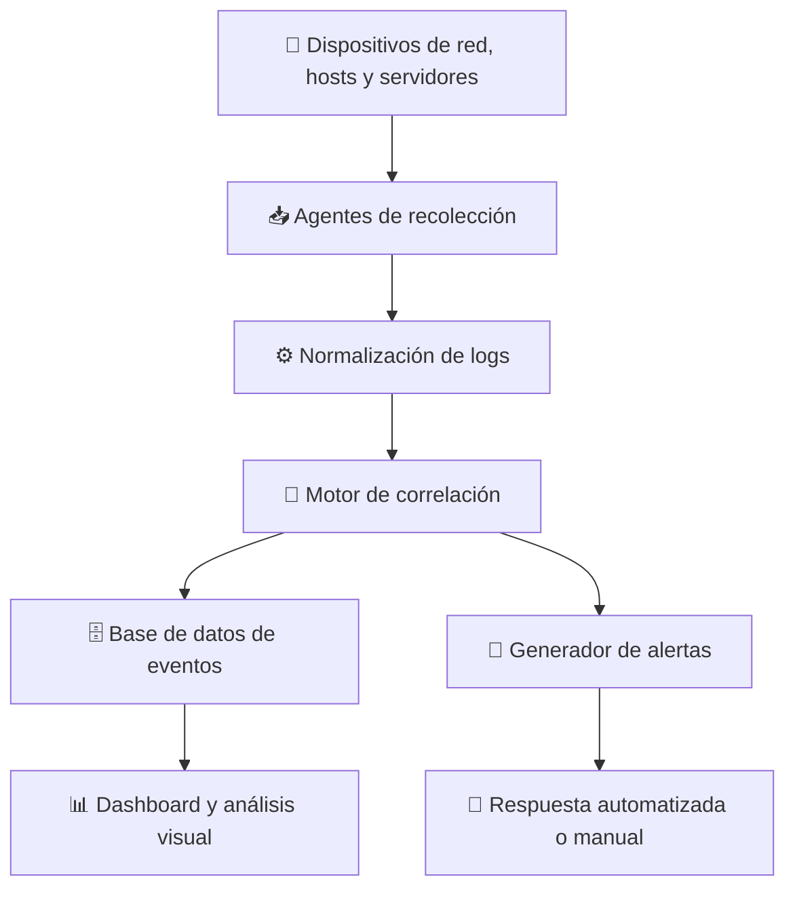

# 🛡️ SIEM: Security Information and Event Management

## 1. 📖 Introducción

El crecimiento exponencial de los ciberataques y la complejidad de los entornos digitales actuales exige a las organizaciones adoptar soluciones capaces de proporcionar:

- 🔎 **Visibilidad** sobre todo lo que ocurre en la red.  
- 📝 **Trazabilidad** para auditar acciones y eventos.  
- ⚡ **Capacidad de respuesta** rápida frente a incidentes.  

En este contexto, los sistemas **SIEM** (Security Information and Event Management) se convierten en una herramienta fundamental, ya que **centralizan y correlacionan eventos de seguridad en tiempo real**, permitiendo tanto su **análisis inmediato** como su **investigación histórica**.

---

## 2. ❓ ¿Qué es un SIEM?

Un **SIEM** es una plataforma que integra dos componentes clave:

- 📂 **SIM (Security Information Management)** → gestión y almacenamiento de la información histórica de seguridad.  
- 🚨 **SEM (Security Event Management)** → gestión en **tiempo real** de eventos de seguridad.  

👉 Su propósito principal es **recopilar, almacenar, normalizar, correlacionar, analizar y visualizar** datos de seguridad para:

- 🔍 Identificar **comportamientos anómalos**.  
- 🛡️ Detectar **intrusiones o actividades maliciosas**.  
- 📑 Cumplir con **regulaciones y normativas**.  
- 🤝 Apoyar a **equipos de respuesta ante incidentes** (Blue Team / SOC).  

---

## 3. 🏗️ Arquitectura General de un SIEM

El flujo típico de funcionamiento de un SIEM sigue estos pasos:

# 🛡️ SIEM: Security Information and Event Management

## 1. 📖 Introducción

El crecimiento exponencial de los ciberataques y la complejidad de los entornos digitales actuales exige a las organizaciones adoptar soluciones capaces de proporcionar:

- 🔎 **Visibilidad** sobre todo lo que ocurre en la red.  
- 📝 **Trazabilidad** para auditar acciones y eventos.  
- ⚡ **Capacidad de respuesta** rápida frente a incidentes.  

En este contexto, los sistemas **SIEM** (Security Information and Event Management) se convierten en una herramienta fundamental, ya que **centralizan y correlacionan eventos de seguridad en tiempo real**, permitiendo tanto su **análisis inmediato** como su **investigación histórica**.

---

## 2. ❓ ¿Qué es un SIEM?

Un **SIEM** es una plataforma que integra dos componentes clave:

- 📂 **SIM (Security Information Management)** → gestión y almacenamiento de la información histórica de seguridad.  
- 🚨 **SEM (Security Event Management)** → gestión en **tiempo real** de eventos de seguridad.  

👉 Su propósito principal es **recopilar, almacenar, normalizar, correlacionar, analizar y visualizar** datos de seguridad para:

- 🔍 Identificar **comportamientos anómalos**.  
- 🛡️ Detectar **intrusiones o actividades maliciosas**.  
- 📑 Cumplir con **regulaciones y normativas**.  
- 🤝 Apoyar a **equipos de respuesta ante incidentes** (Blue Team / SOC).  

---

## 3. 🏗️ Arquitectura General de un SIEM

El flujo típico de funcionamiento de un SIEM sigue estos pasos:

***
© 2025 [sualba.dev] -Todos los derechos reservados
Este material forma parte de mi portfolio profesional y ha sido desarrollado como parte de mi formación en ciberseguridad.
