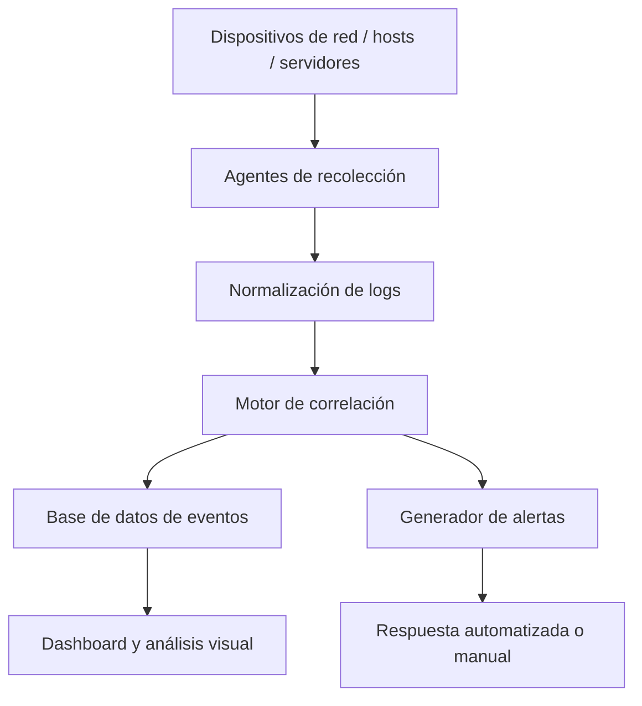

# 🛡️ SIEM: Security Information and Event Management

---

## 1. Introducción

El crecimiento exponencial de los ciberataques y la complejidad de los entornos digitales actuales exige a las organizaciones adoptar soluciones capaces de proporcionar **visibilidad, trazabilidad y capacidad de respuesta** en materia de seguridad. Una de las herramientas fundamentales en este contexto son los sistemas **SIEM** (Security Information and Event Management), los cuales centralizan y correlacionan eventos de seguridad en tiempo real, permitiendo tanto su análisis inmediato como histórico.

---

## 2. ¿Qué es un SIEM?

Un SIEM es una plataforma que combina dos funcionalidades principales:

- **SIM (Security Information Management)**: gestión de información de seguridad histórica.
- **SEM (Security Event Management)**: gestión en tiempo real de eventos de seguridad.

Su objetivo es **recopilar, almacenar, correlacionar, analizar y visualizar** los datos generados por los sistemas y dispositivos de una red con el fin de:

- Identificar comportamientos anómalos.
- Detectar intrusiones o actividades maliciosas.
- Cumplir con regulaciones legales.
- Apoyar a equipos de respuesta ante incidentes (Blue Team / SOC).

---

## 3. Arquitectura general de un SIEM

---

## 4. SIM vs SEM: Diferencias clave

| Dimensión                 | SIM                                                    | SEM                                                     |
|---------------------------|---------------------------------------------------------|----------------------------------------------------------|
| **Enfoque**               | Historial de seguridad                                  | Análisis y respuesta en tiempo real                      |
| **Tipo de datos**         | Logs antiguos, auditorías, registros                    | Eventos activos, comportamiento anómalo                  |
| **Temporalidad**          | Post-mortem, forense                                   | Instantáneo, proactivo                                   |
| **Aplicaciones**          | Cumplimiento, trazabilidad, análisis forense           | Detección de amenazas, alertas automatizadas             |
| **Ejemplo típico**        | Informe de accesos a bases de datos sensibles           | Detección de ataque de fuerza bruta en tiempo real       |
| **Impacto en SOC**        | Apoyo a investigaciones retrospectivas                  | Acción directa ante incidentes                           |

---

## 5. Ejemplos reales bien desarrollados

### 🎯 Caso 1: Fuga interna de información (Uso de SIM)

**Contexto**:  
Un empleado con permisos legítimos accede de forma reiterada a documentación confidencial fuera del horario laboral, y se sospecha de una fuga de datos.

**Desarrollo**:
1. Consulta retrospectiva en el SIEM sobre accesos al repositorio `/srv/hr_docs/`.
2. Identificación de accesos nocturnos desde un único usuario.
3. Correlación con conexión de dispositivos USB.

**Resultado**:  
La evidencia permite iniciar acciones disciplinarias y aplicar nuevas políticas DLP.

---

### 🎯 Caso 2: Ataque externo tipo fuerza bruta (Uso de SEM)

**Contexto**:  
Un atacante intenta comprometer credenciales SSH.

**Desarrollo**:
1. Detección de 40 intentos fallidos desde una misma IP.
2. Regla de correlación marca el evento como "Brute Force".
3. Se genera alerta y se bloquea automáticamente la IP.

**Resultado**:  
Amenaza contenida y elevada al SOC para análisis forense.

---

## 6. Herramientas SIEM: Comparativa técnica

| Herramienta     | Tipo       | Características clave                                                                                      | Casos de uso ideales                         |
|-----------------|------------|-------------------------------------------------------------------------------------------------------------|----------------------------------------------|
| **Splunk**      | Comercial  | Visualización avanzada, análisis ML, queries SPL, dashboards dinámicos.                                   | Grandes empresas, entornos críticos.         |
| **IBM QRadar**  | Comercial  | Fuerte motor de correlación, integración con sistemas IBM, foco en cumplimiento.                           | Sector financiero, organismos regulados.     |
| **Elastic SIEM**| Open Source| Basado en Elasticsearch + Kibana, flexible, potente, escalable.                                            | Startups, organizaciones con recursos medios.|
| **Wazuh**       | Open Source| Correlación + agente ligero, integración con ELK, gran comunidad.                                          | PYMEs, SOCs propios, proyectos educativos.   |
| **ArcSight**    | Comercial  | Larga trayectoria, enfoque en cumplimiento legal y correlación de alto nivel.                              | Infraestructuras críticas, gobierno.         |
| **Azure Sentinel**| Cloud    | Nativo en Azure, automatización con LogicApps, escalabilidad elástica.                                     | Entornos 100% cloud / híbridos.              |

---

## 7. Normativas y marcos de referencia

- **ISO/IEC 27001** – Gestión de Seguridad de la Información.
- **NIST SP 800-137** – Continuous Monitoring.
- **MITRE ATT&CK** – Framework de tácticas y técnicas adversarias.
- **GDPR / RGPD** – Protección de datos personales.
- **PCI-DSS** – Seguridad en sistemas de tarjetas de crédito.

---

## 8. Conclusión

La implementación de una plataforma SIEM aporta:

- Visibilidad centralizada.
- Capacidad de respuesta ante incidentes.
- Trazabilidad completa.
- Cumplimiento de normativas.
- Apoyo esencial al SOC.

> En un entorno donde el tiempo medio de detección es crítico, un SIEM constituye un **pilar esencial** de ciberdefensa.

---

## 9. Referencias

- NIST SP 800-137: https://csrc.nist.gov/publications/detail/sp/800-137/final  
- MITRE ATT&CK: https://attack.mitre.org  
- Elastic SIEM Docs: https://www.elastic.co/guide/en/security/current/index.html  
- IBM QRadar: https://www.ibm.com/qradar  
- Splunk SIEM: https://www.splunk.com/en_us/solutions/siem.html  
- Wazuh Documentation: https://documentation.wazuh.com

***
 © 2025 [sualba.dev] Todos los derechos reservados.
  Este material forma parte de mi portfolio profesional y ha sido desarrollado como parte de mi formación en ciberseguridad.