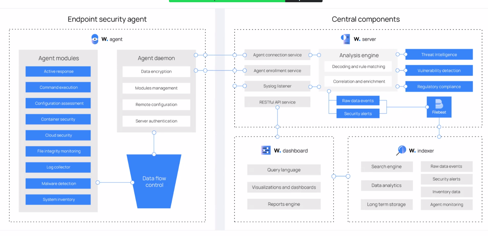

# 🛡️ Arquitectura de Seguridad de Wazuh

Wazuh es una plataforma de seguridad open-source que permite la detección de intrusos (IDS), monitoreo de integridad, cumplimiento normativo, y respuesta ante incidentes. Este documento explica su arquitectura con todo detalle.

---

## 🧭 Visión General

La arquitectura de Wazuh se divide en dos grandes bloques principales:

- **Endpoint Security Agent (Agente de seguridad del endpoint)**: Se instala en los dispositivos a proteger (servidores, contenedores, etc.).
- **Central Components (Componentes centrales)**: Analizan, almacenan y visualizan la información recopilada por los agentes.

---

## 📌 Diagrama Arquitectónico




---

## 🧩 1. Endpoint Security Agent (Agente)

### 🔹 Wazuh Agent
Instalado en cada endpoint. Se encarga de recopilar y enviar datos al servidor Wazuh.

### 🔸 Agent Modules (Módulos del agente)

| Módulo                     | Función principal                                                                 |
|---------------------------|-----------------------------------------------------------------------------------|
| **Active Response**       | Respuesta automática ante amenazas (p. ej. bloqueo de IPs)                        |
| **Command Execution**     | Ejecuta comandos desde el servidor                                                |
| **Configuration Assessment** | Evalúa configuraciones del sistema y su cumplimiento                            |
| **Container Security**    | Seguridad en entornos de contenedores como Docker                                |
| **Cloud Security**        | Integración con nubes como AWS, GCP, Azure                                       |
| **File Integrity Monitoring** | Monitoreo de cambios en archivos críticos                                   |
| **Log Collector**         | Recoge logs del sistema                                                           |
| **Malware Detection**     | Detección de malware por firmas o comportamiento                                 |
| **System Inventory**      | Inventario completo de hardware y software                                       |

---

### 🔸 Agent Daemon

| Componente              | Funcionalidad                                                  |
|-------------------------|---------------------------------------------------------------|
| **Data Encryption**     | Cifrado seguro entre agente y servidor                        |
| **Modules Management**  | Gestión de módulos del agente                                 |
| **Remote Configuration**| Configuración remota del agente                               |
| **Server Authentication** | Autenticación con el servidor Wazuh                         |

> Toda esta información pasa por un sistema de **control de flujo de datos (Data Flow Control)** hacia los componentes centrales.

---

## 🧩 2. Central Components (Componentes Centrales)

### 🔹 Wazuh Server

| Servicio                      | Función principal                                                  |
|------------------------------|---------------------------------------------------------------------|
| **Agent Connection Service** | Conexión de los agentes con el servidor                            |
| **Agent Enrollment Service** | Registro (alta) de nuevos agentes                                  |
| **Syslog Listener**          | Escucha y recepción de logs vía Syslog                             |
| **RESTful API Service**      | Interfaz API para interactuar con el servidor desde otras apps     |

---

### 🔸 Analysis Engine (Motor de análisis)

| Mecanismo                         | Explicación                                                              |
|----------------------------------|--------------------------------------------------------------------------|
| **Decoding and Rule Matching**   | Decodifica logs y aplica reglas para detectar amenazas                   |
| **Correlation and Enrichment**   | Correlaciona eventos entre sí y los enriquece con metadatos              |

#### 🔍 Áreas clave del análisis:

- **Threat Intelligence**: Comparación con listas negras o fuentes de amenazas conocidas
- **Vulnerability Detection**: Identificación de vulnerabilidades en endpoints
- **Regulatory Compliance**: Evaluación de cumplimiento con normas como PCI, GDPR, etc.

---

### 🔸 Salida del Motor de Análisis

- **Raw Data Events**: Eventos originales sin procesar
- **Security Alerts**: Alertas generadas a partir de reglas

Estos datos son enviados a **Filebeat**, que reenvía la información al sistema de indexación.

---

### 🔹 Filebeat

Se encarga de trasladar los datos procesados al motor de búsqueda/indexación (normalmente Elasticsearch/Wazuh Indexer).

---

## 📊 3. Visualización y Almacenamiento

### 🔹 Wazuh Dashboard

| Funcionalidad                       | Descripción                                      |
|------------------------------------|--------------------------------------------------|
| **Query Language**                 | Lenguaje de búsqueda personalizado               |
| **Visualizations and Dashboards** | Gráficas, alertas, paneles de control            |
| **Reports Engine**                 | Generación de informes exportables               |

---

### 🔹 Wazuh Indexer (Elasticsearch u OpenSearch)

| Componente       | Función principal                                    |
|------------------|------------------------------------------------------|
| **Search Engine**| Motor de búsqueda avanzado                           |
| **Data Analytics**| Análisis de eventos                                 |
| **Long Term Storage**| Almacenamiento a largo plazo                     |
| **Monitored Data**| Eventos, alertas, inventario, monitoreo de agentes |

---

## ✅ Resumen General del Flujo

```text
[Endpoint con agente Wazuh]
     ↓
[Módulos como FIM, Logs, Respuesta Activa]
     ↓
[Servidor Wazuh (motor de análisis)]
     ↓
[Filebeat → Wazuh Indexer (Elasticsearch)]
     ↓
[Dashboard de visualización]
